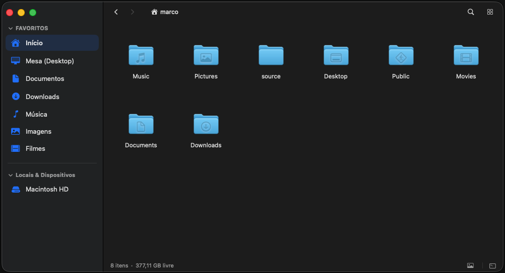

# Wiles

### The file manager macOS has been missing.

Fast, focused, and built entirely for your Mac. No bloat, no compromises.

Every window opens instantly. Every interaction feels considered. Every detail has been sweated over. A file manager that finally feels like it was made for your Mac. Because it was.



---

## What's New
Check out the latest features and updates in our Release Notes!
👉 **[Read the Release Notes](RELEASE_NOTES.md)**

---

## ⚡️ Quick Install (Homebrew & Direct DMG)

### Option 1: Direct DMG Download (GUI)
Download the **[Latest Release DMG](https://github.com/marcops/wiles/tree/main/releases)**, open it, and drag `Wiles.app` to `/Applications`.

### Option 2: Homebrew Cask Terminal
```bash
brew tap marcops/wiles git@github.com:marcops/wiles.git
brew install --cask wiles
```

> **Note**: Wiles isn't distributed through the Mac App Store, so macOS may ask you to confirm you trust it the first time you open it.
>
> If Gatekeeper blocks the app instead of just asking, Right-Click **Wiles.app** in Finder and choose **Open** — or run:
> ```bash
> xattr -cr /Applications/Wiles.app
> ```

To update anytime:
```bash
brew upgrade --cask wiles
```

---

## Meet Wiles

**Instant, by design.**
Wiles opens the moment you click it — no splash screen, no spinner, no waiting around. Every interaction, from opening a folder of thousands of files to zooming your icon grid, is built to feel immediate.

**Two ways to move. Both fully yours.**
Prefer modifier keys? `Cmd+Down` opens, `Return` renames, `Cmd+Up` goes up. Prefer single-key speed? `Enter` opens, `F2` renames, `Backspace` goes up. Wiles adapts to how you move — switch anytime in Preferences.

**See where your space went.**
Hit `Cmd+Shift+D` and watch a visual, proportional breakdown of your biggest files and folders appear — instantly, with nothing to install and nothing to wait for.

**Rename one file or five thousand.**
A live before/after preview shows you exactly what's about to happen — find & replace, prefixes and suffixes, sequential numbering — before you commit to anything.

**Convert and crop, right where you are.**
Drag-select a crop, resize to an exact pixel count, or flip between JPEG, PNG, HEIC, and TIFF — without ever leaving the file list.

**Compression that doesn't get in your way.**
Zip and unzip run in the background on Apple's own compression engine, so a large archive never freezes your window.

**Browse it your way.**
Stick with familiar Places and Favorites, or open a full Directory Tree and see your entire filesystem laid out at once.

**Sweated over, down to the pixel.**
Real drag previews with shadows, folders that light up as valid drop targets, marquee box selection, Quick Look on `Space`, instant search on `Cmd+F` — the details that make a file manager feel like it belongs on your Mac.

**Fluent in five languages.**
English, Portuguese, Spanish, French, and German, detected automatically from your system language — switchable anytime.

---

## ⚙️ Why It Feels This Fast

**A real Mac app, not a website in a window.**
Wiles is built from the ground up for your Mac — not adapted from some other platform. That's the difference between an app that launches instantly and feels at home on your desktop, and one that makes you wait.

**Small on disk. Light on battery.**
No bundled browser hiding inside, no background processes dragging your fans on. Just a small app doing exactly what it's asked and nothing else.

### Shortcuts Cheatsheet

| Action | Shortcut |
| :--- | :--- |
| **Quick Look** | `Space` |
| **Open Item** | `Double Click` or `Enter` (Quick) / `Cmd + Down` (Classic) |
| **Rename Item(s)** | `F2` (Quick) / `Return` (Classic) |
| **Go Up Directory** | `Backspace` (Quick) / `Cmd + Up` (Classic) |
| **Disk Usage Visualizer** | `Cmd + Shift + D` |
| **Focus Path Bar** | `Cmd + L` |
| **In-Folder Search** | `Cmd + F` |
| **Move to Trash** | `Cmd + Delete` or `Delete` |
| **Copy / Cut / Paste** | `Cmd + C` / `Cmd + X` / `Cmd + V` |
| **Toggle Hidden Files** | `Cmd + Shift + .` (Classic) / `Ctrl + H` (Quick) |
| **Properties (Get Info)** | `Cmd + I` |

---

## 💬 Feedback, Feature Requests & Bug Reports

Have a feature request or found a bug? We welcome your feedback!

Please submit all bug reports and feature proposals directly via **GitHub Issues**:
- 🐛 **Report a Bug**: [Open a Bug Report](https://github.com/marcops/wiles/issues/new?template=bug_report.md)
- 💡 **Request a Feature**: [Submit a Feature Request](https://github.com/marcops/wiles/issues/new?template=feature_request.md)

---

## 📄 License

MIT License.
