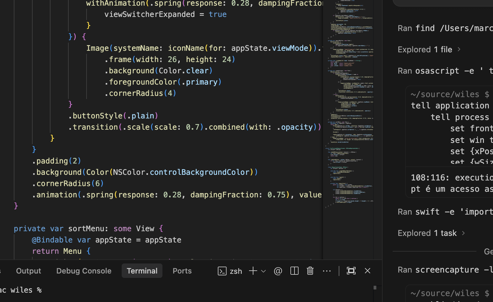
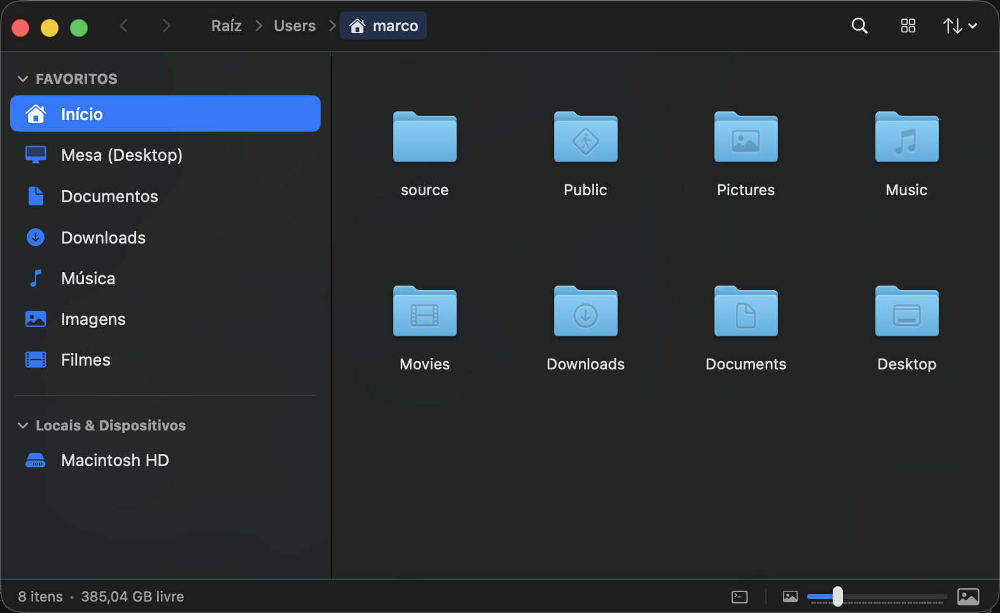

# Wiles

A fast, native macOS file manager designed for speed, bridging the best of **GNOME Files (Nautilus)** and **macOS Finder**.



---

## 🆕 What's New
Check out the latest features and updates in our Release Notes!
👉 **[Read the Release Notes (v0.0.5)](RELEASE_NOTES.md)**

---

## ⚡️ Quick Install (Homebrew & Direct DMG)

### Option 1: Direct DMG Download (GUI)
Download the **[Latest Release DMG](https://github.com/marcops/wiles/releases/latest)**, open it, and drag `Wiles.app` to `/Applications`.

### Option 2: Homebrew Cask Terminal
```bash
brew tap marcops/wiles git@github.com:marcops/wiles.git
brew install --cask wiles
```

> **Note**: Since Wiles is self-compiled (un-notarized by Apple), macOS Gatekeeper may block it on first open.
>
> To unlock the app on first launch, run:
> ```bash
> xattr -cr /Applications/Wiles.app
> ```
> Or Right-Click **Wiles.app** in Finder and choose **Open**.

To update anytime:
```bash
brew upgrade --cask wiles
```

---

## 🎯 Highlights

- **Ultra-Fast Native UI**: Built purely in Swift & SwiftUI with AppKit integration. Zero electron bloat.
- **Dual Navigation Modes**:
  - **macOS Finder**: `Cmd+Down` to open, `Enter` to rename, `Cmd+Up` to go up.
  - **GNOME Nautilus**: `Enter` to open, `F2` to rename, `Backspace` to go up.
- **Folder Disk Usage Visualizer**: Visual breakdown of top 10 largest files/subfolders with colored proportional bars and "Others" grouping (`Cmd+Shift+D`).
- **Single & Batch File Renamer**: Rename individual files or batch rename multiple files with live before/after previews (Find & Replace, Prefix/Suffix, Sequence Numbering).
- **Native Image Converter & Crop**: Quick format conversion (`JPEG`, `PNG`, `HEIC`, `TIFF`), aspect ratio cropping, interactive drag-to-crop selection, and exact pixel resizer.
- **Native ZIP Compression**: Built-in async compression & extraction via Apple's native `/usr/bin/ditto`.
- **Flexible Sidebar**: Toggle between standard Places/Favorites and a full **Directory Tree**.
- **Seamless Drag & Drop**: Native drag preview shadows, folder drop targets, and background marquee box selection.
- **Quick Look & Search**: Press `Space` for Quick Look previews, `Cmd+F` for instant in-folder search.
- **Strict i18n Localization**: Supports English, Portuguese, Spanish, French, and German with automatic macOS language detection.

---

## 📸 Screenshots

| Grid View | List View |
| :---: | :---: |
|  |  |

---

## ⌨️ Shortcuts Cheatsheet

| Action | Shortcut |
| :--- | :--- |
| **Quick Look** | `Space` |
| **Open Item** | `Double Click` or `Enter` (GNOME) / `Cmd + Down` (macOS) |
| **Rename Item(s)** | `F2` (GNOME) / `Return` (macOS) |
| **Go Up Directory** | `Backspace` (GNOME) / `Cmd + Up` (macOS) |
| **Disk Usage Visualizer** | `Cmd + Shift + D` |
| **Focus Path Bar** | `Cmd + L` |
| **In-Folder Search** | `Cmd + F` |
| **Move to Trash** | `Cmd + Delete` or `Delete` |
| **Copy / Cut / Paste** | `Cmd + C` / `Cmd + X` / `Cmd + V` |
| **Toggle Hidden Files** | `Cmd + Shift + .` (macOS) / `Ctrl + H` (GNOME) |
| **Properties (Get Info)** | `Cmd + I` |

---

## 💬 Feedback, Feature Requests & Bug Reports

Have a feature request or found a bug? We welcome your feedback!

Please submit all bug reports and feature proposals directly via **GitHub Issues**:
- 🐛 **Report a Bug**: [Open a Bug Report](https://github.com/marcops/wiles/issues/new?template=bug_report.md)
- 💡 **Request a Feature**: [Submit a Feature Request](https://github.com/marcops/wiles/issues/new?template=feature_request.md)

---

## 📄 License

MIT License.
